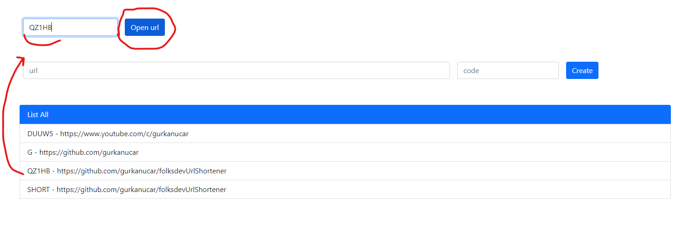

# Url Shortener Project

This is a simple url shortener project which is using in-memory db.

- Spring Boot
- Exception Handling
- Validation
- H2 Database
- Deployin to Heroku

Recorded Stream: [https://www.youtube.com/watch?v=GOyMQ5UTueA](https://www.youtube.com/watch?v=GOyMQ5UTueA)


## Example Images

- Go to the base url for index.html (gui interface):
    #### ex: http://localhost:8080



## API Reference

- #### Get all urls

```http
  GET /all
```
#### Response:
```javascript
[
    {
        "id": 1,
        "url": "https://github.com/gurkanucar",
        "code": "GIT"
    },
    {
        "id": 2,
        "url": "https://www.youtube.com/c/gurkanucar",
        "code": "YT"
    }
]
```
##

- #### Show Url of Code (alias)

```http
  GET /show/{code}
```

| Parameter | Type     | Description                       |
| :-------- | :------- | :-------------------------------- |
| `code`      | `string` | **Required**. Code of url to fetch |

#### Response:
```javascript
{
    "id": 1,
    "url": "https://github.com/gurkanucar",
    "code": "GIT"
}
```
##

- #### Create Short Url

```http
  GET /show/{code}
```

| Parameter | Type     | Description                       |
| :-------- | :------- | :-------------------------------- |
| `url`      | `string` | **Required**. Code of url to fetch |
| `code`      | `string` | **Not Required**. If it is null or empty, it will be created automatically. |

#### Request:
```javascript
{
    "url": "https://github.com/gurkanucar",
    "code": "g"
}
```

#### Response:
```javascript
{
    "id": 3,
    "url": "https://github.com/gurkanucar",
    "code": "G"
}
```

## Installation


```bash
   git clone https://github.com/gurkanucar/folksdevUrlShortener.git

  cd folksdevUrlShortener

  mvn spring-boot:run
```
    